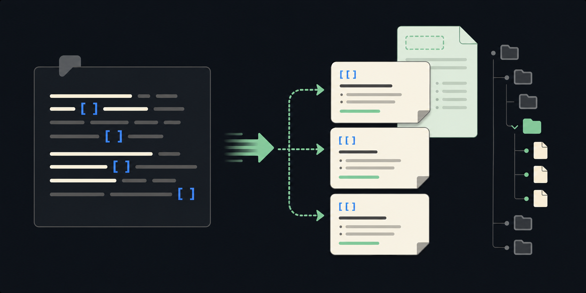

# Auto Create Notes on Paste

Automatically create missing Markdown notes for wikilinks detected in pasted text. You can also scan the active file from Command Palette to create every missing wikilink target in that file.

> The image is an illustrative example of the workflow, not a screenshot of the plugin.

## Use cases

Useful for meeting notes, research excerpts, or outlines that reference people, projects, and concepts you want to turn into navigable notes immediately.

## Install

1. Copy this folder to <vault>/.obsidian/plugins/auto-create-on-paste/.
2. Ensure manifest.json, main.js, and styles.css are present.
3. Enable **Auto Create Notes on Paste** under Settings → Community plugins.

The plugin is desktop-only and ships with a prebuilt main.js.

## Usage

### Automatic creation

1. Open a Markdown note.
2. Paste text containing wikilinks such as [[People/Alan Turing]] or [[Alan Turing|Alan]].
3. When **Create on paste** is enabled, the plugin creates missing targets.

### Manual scan

Open Command Palette and run **Create notes for missing wikilinks in current file**. The command scans the entire active file and creates missing targets.

## Settings

- **Create on paste** enables or disables automatic creation.
- **Destination** chooses between a fixed folder and the current note's folder.
- **Fixed folder** sets a vault-relative destination.
- **Respect link's folder path** honors paths embedded in links such as People/Alan Turing.
- **Use template** applies a vault-relative Markdown template.
- **Template file path** identifies the template; {{title}} and {{alias}} are replaced.

The plugin avoids duplicate creation within a single paste and sanitizes filenames for common desktop filesystems. If a link includes an alias and the template does not begin with YAML frontmatter, it can prepend a basic alias block.

## Limitations

- It creates files for missing wikilink targets; it does not infer note content.
- Complex template or YAML-merging needs should be handled by a dedicated templating plugin.
- Review destination settings before enabling automatic creation in a large vault.

## License

MIT. See [LICENSE](LICENSE).

